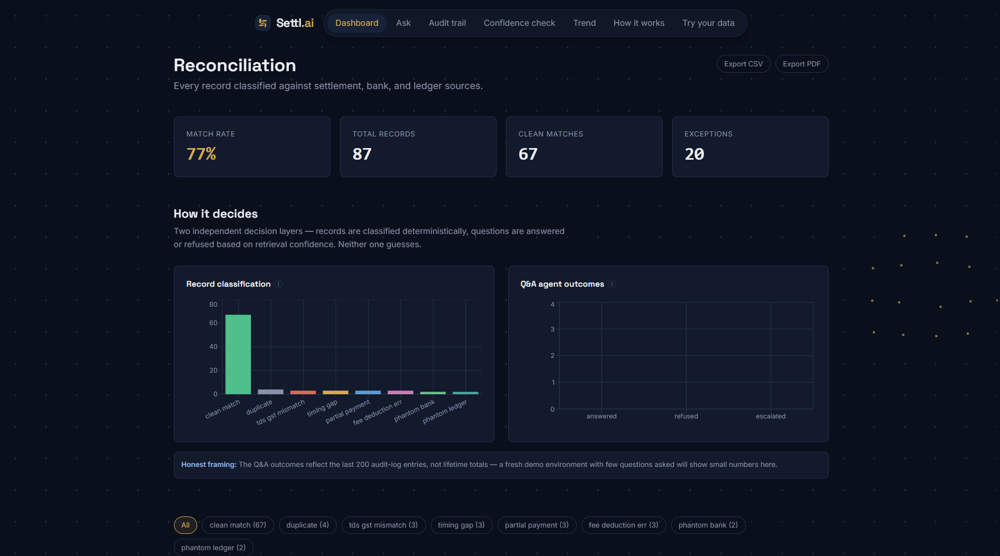
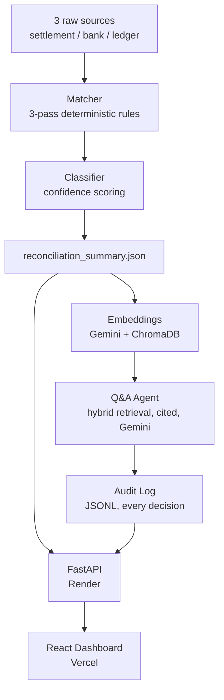

# 💳 Settl.ai

### Agentic Reconciliation Copilot with Deterministic Matching, Confidence-Scored Exceptions, and Grounded Q&A

[](https://settl-ai.vercel.app/)
[](https://settl-ai.onrender.com/docs)
[](https://www.python.org/)
[](https://react.dev/)
[](https://fastapi.tiangolo.com/)

[**Live App**](https://settl-ai.vercel.app/) · [**API Docs**](https://settl-ai.onrender.com/docs) · [**Report Bug**](https://github.com/nikhil-0420/Settl-ai/issues)

> ⚠️ **Note:** The backend runs on Render's free tier and may take 20–30 seconds to wake up on the first request.

---

## 📌 Overview

Every payment-gateway settlement cycle produces three sources of truth — what
the gateway says it settled, what actually hit the bank account, and what the
merchant's own ledger expected — and they rarely agree perfectly. Someone on
a finance team normally reconciles these by hand, spreadsheet by spreadsheet.

Settl.ai automates that end to end:

- Classifies every settlement record against a **deterministic 3-pass
  matching engine** (fee/TDS arithmetic → amount tolerance → date window),
  catching duplicates and orphaned ("phantom") bank/ledger rows too
- Assigns a **per-record confidence score** that reflects distance from the
  tolerance boundary — not a flat constant per status — and validates that
  claim with a real correlation check against seeded deviation magnitude,
  not a synthetic label
- Answers plain-English questions ("why didn't order_X reconcile?") through
  a **grounded Q&A agent**: hybrid vector + exact-ID retrieval over ChromaDB,
  forced per-order citations, and explicit refusal — with graceful fallback
  to human escalation — when the data doesn't support a confident answer
- Logs **every agent decision** (answered / refused / escalated / timed out)
  to an audit trail for review

Built for the **Razorpay AI Buildathon — AI Finance Controller track**, and
deployed as a working full-stack app: **FastAPI backend on Render**, **React
dashboard on Vercel**.

---

## 🖥️ Dashboard Preview

 [](./assets/dashboard.png)

The app includes:

- **Dashboard** — total records, match rate, and status breakdown at a glance
- **Record Detail** — full 3-way settlement/bank/ledger comparison for a
  single order, with its classification, confidence score, and resolution
- **Ask** — grounded Q&A chat over the reconciliation data, with citations
- **Audit** — a browsable log of every agent decision and why it was made
- **Calibration** — the confidence-scoring validation, plotted
- **Trend** — match rate and breakdown across reconciliation cycles
- **Live Upload** — reconcile a fresh set of CSVs on demand

---

## ✨ Features

| Feature | Description |
| --- | --- |
| 🧮 **Deterministic Matching Engine** | 3-pass classification — fee/TDS arithmetic checks, amount-tolerance fuzzy matching, date-window pass — plus duplicate and phantom-record detection |
| 🎯 **Confidence Scoring** | Per-record score reflecting distance from the tolerance boundary, so borderline classifications score lower than unambiguous ones |
| 📈 **Calibration Validation** | Spearman rank correlation between each record's confidence and its *real* seeded deviation magnitude — checks the scoring formula's own claim, not a synthetic ground truth |
| 🤖 **Grounded Q&A Agent** | Gemini-powered, hybrid semantic + exact-ID retrieval (ChromaDB), forced per-order citation format, explicit refusal when unsupported |
| 🛡️ **Failure-Mode Handling** | Live-inducible LLM outage/timeout simulation that escalates to a human reviewer instead of guessing or hanging |
| 📜 **Audit Trail** | Append-only log of every agent decision (answered / refused / escalated / timed out) with its reasoning |
| 📤 **Live Upload** | Reconcile a brand-new set of settlement/bank/ledger CSVs on demand via the API, independent of the seeded dataset |
| 📦 **Exports** | Download the full reconciliation summary as CSV or PDF |
| 🧪 **Synthetic Data + Ground Truth** | Reproducible dataset generator seeding every exception type, so the matcher can be self-graded for exact accuracy |

---

## 🏗️ Tech Stack

**AI / Retrieval**

- Gemini API (`gemini-3.5-flash-lite`) for the Q&A agent
- Gemini (`gemini-embedding-001`) for embeddings
- ChromaDB for vector storage and hybrid (semantic + exact-ID) retrieval

**Backend**

- FastAPI · pandas · rapidfuzz
- matplotlib (calibration plots) · reportlab (PDF export)
- pytest, run in CI on every push/PR
- Deployed on Render

**Frontend**

- React 18 + Vite
- Tailwind CSS · Framer Motion · Recharts · React Router
- Deployed on Vercel

---

## 📐 Architecture



---

## 📊 Evaluation

The confidence-scoring formula claims that a bigger deviation from the
tolerance boundary means a more unambiguous — and therefore higher- or
lower-confidence, depending on direction — classification. Since the matcher
is 100% accurate against ground truth, a standard calibration curve would
trivially show every bucket at 100% and prove nothing. Instead,
`calibration.py` checks that specific directional claim against the real
seeded deviation magnitude recomputed from the raw CSVs (not a stored label),
via Spearman rank correlation:

| Status | Expected direction | Check |
| --- | --- | --- |
| `partial_payment` | bigger shortfall → higher confidence | ✅ correlation checked |
| `fee_deduction_err` | bigger fee error → higher confidence | ✅ correlation checked |
| `tds_gst_mismatch` | bigger TDS error → higher confidence | ✅ correlation checked |
| `timing_gap` | bigger day gap → lower confidence (closer to "unmatched") | ✅ correlation checked |

Run `python app/calibration.py` to regenerate the correlation report and the
scatter-plot visual (`confidence_severity_validation.png`).

---

## 🚀 Getting Started

### Prerequisites

- Python 3.12+
- Node.js 18+
- A [Gemini API key](https://ai.google.dev/) (for embeddings + the Q&A agent)

### 1. Clone the repository
```bash
git clone https://github.com/nikhil-0420/Settl-ai.git
cd Settl-ai
```

### 2. Backend setup
```bash
cd backend
python -m venv venv
venv\Scripts\activate      # Windows
source venv/bin/activate   # macOS/Linux
pip install -r requirements.txt
```

Create `backend/.env`:
```env
GEMINI_API_KEY=your_gemini_key_here
```

Generate the dataset and build the reconciliation summary:
```bash
python app/generate_data.py     # synthetic settlement/bank/ledger CSVs + ground truth
python app/classifier.py        # runs the matcher, writes reconciliation_summary.json
uvicorn app.main:app --reload
```

Backend runs at `http://localhost:8000`
Docs at `http://localhost:8000/docs`

### 3. Frontend setup
```bash
cd frontend
npm install
cp .env.example .env
npm run dev
```

Frontend runs at `http://localhost:5173`

`.env` (or `.env.example` defaults):
```env
VITE_API_URL=http://localhost:8000
```

### Optional
```bash
python app/calibration.py   # confidence-scoring validation + plot
pytest tests/ -v            # regression suite
```

---

## 📂 Project Structure

```text
Settl-ai/
├── backend/
│   ├── app/
│   │   ├── generate_data.py    # synthetic 3-source dataset + ground truth
│   │   ├── matcher.py          # deterministic 3-pass matching engine
│   │   ├── classifier.py       # exception classification + confidence scoring
│   │   ├── calibration.py      # validates confidence scoring against real deviation
│   │   ├── embeddings.py       # Chroma + Gemini embeddings, hybrid retrieval
│   │   ├── qa_agent.py         # grounded Q&A agent (Gemini, cited, refuses when unsure)
│   │   ├── audit.py            # append-only JSONL audit log
│   │   ├── resolutions.py      # manual "mark resolved" notes on records
│   │   ├── export.py           # CSV / PDF export
│   │   └── main.py             # FastAPI app tying it all together
│   ├── data/                   # generated CSVs, ground truth, summaries
│   └── tests/                  # pytest regression tests
├── frontend/
│   └── src/
│       ├── pages/       # Landing, Dashboard, RecordDetail, Ask, Audit, Calibration, Trend, Appendix, LiveUpload
│       ├── components/  # nav, cards, decision trace/panels, command palette, backgrounds, etc.
│       └── lib/          # API client, small utilities
└── README.md
```

---

## 🔬 Methodology Highlights

1. **Deterministic-first design** — matching runs on explicit arithmetic and
   tolerance rules, not a model, so every classification is exactly
   explainable and self-gradeable against ground truth
2. **Confidence as a claim, not a label** — the scoring formula makes a
   specific, checkable claim (distance from tolerance boundary ⇒ certainty),
   and `calibration.py` verifies that claim against real recomputed
   deviation rather than assuming it
3. **Hybrid retrieval** — semantic embeddings alone don't reliably surface
   arbitrary alphanumeric order IDs, so the Q&A agent checks for an explicit
   ID first and falls back to (or pads with) vector search
4. **Forced grounding** — the Q&A agent must cite a specific `order_id` for
   every factual claim and is instructed to refuse outright rather than
   guess when retrieved records don't support a confident answer
5. **Designed-in failure handling** — LLM timeout and outage are simulatable
   on demand, so the human-escalation fallback path can be demonstrated
   directly rather than only described
6. **Full audit trail** — every agent decision (answered, refused, escalated,
   timed out) is logged with its reasoning, not just successful responses

---

## 🎯 Key Findings

- Splitting classification into three ordered passes (fee/TDS → amount →
  date) surfaced errors that a single amount-tolerance check would have
  mislabeled — e.g. a fee-deduction error can look like a clean match on
  net amount alone if checked in the wrong order
- Confidence scoring needed to be a *function of the actual deviation*, not
  a constant per status, for the confidence values to carry any real
  meaning across borderline vs. clear-cut cases within the same status
- Semantic vector search is a poor fit for retrieving specific order IDs —
  the hybrid exact-match-first approach was necessary, not optional
- Running the embedding client and Chroma collection as lazy, per-process
  singletons (rather than per-call) was necessary to avoid crashes under
  FastAPI's concurrent request handling

---

## 🔮 Future Work

- Evaluation writeup covering matcher accuracy, confidence calibration
  results, and Q&A agent citation reliability end to end
- Expand the exception taxonomy beyond the currently seeded types
  (e.g. currency/FX mismatches, multi-leg settlements)
- Batch/scheduled reconciliation runs instead of an on-demand `/upload`
  trigger
- Broader automated test coverage for the Q&A agent's refusal behavior

---

## 👤 Author

**Nikhil**
[GitHub](https://github.com/nikhil-0420)

Built for the Razorpay AI Buildathon — AI Finance Controller track.

---

**⭐ If you found this project interesting, consider giving it a star.**
