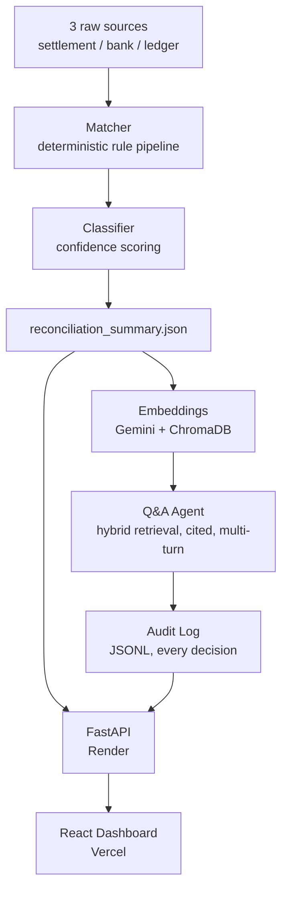

# 💳 Settl.ai

### Agentic Reconciliation Copilot with Deterministic Matching, Confidence-Scored Exceptions, and Grounded Q&A

[](https://settl-ai.vercel.app/)
[](https://settl-ai.onrender.com/docs)
[](https://github.com/nikhil-0420/Settl-ai/actions)
[](https://www.python.org/)
[](https://react.dev/)
[](https://fastapi.tiangolo.com/)

[**Live App**](https://settl-ai.vercel.app/) · [**API Docs**](https://settl-ai.onrender.com/docs) · [**Report Bug**](https://github.com/nikhil-0420/Settl-ai/issues)

> ⚠️ **Note:** The backend runs on Render's free tier and may take 20–30 seconds to wake up on the first request.

---

## 📌 Overview

Every payment-gateway settlement cycle produces three sources of truth — what
the gateway says it settled, what actually hit the bank account, and what the
merchant's own ledger expected — and they rarely agree perfectly. Someone on
a finance team normally reconciles these by hand, spreadsheet by spreadsheet.

Settl.ai automates that end to end:

- Classifies every settlement record against a **deterministic matching
  engine** (fee/TDS arithmetic → amount tolerance → date window → ledger
  cross-check), catching duplicates and orphaned ("phantom") bank/ledger
  rows too
- Assigns a **per-record confidence score** that reflects distance from the
  tolerance boundary — not a flat constant per status — and validates that
  claim with a real correlation check against seeded deviation magnitude,
  not a synthetic label
- Answers plain-English questions ("why didn't order_X reconcile?") through
  a **grounded Q&A agent**: hybrid vector + exact-ID retrieval over ChromaDB,
  forced per-order citations, multi-turn follow-up support, and explicit
  refusal — with graceful fallback to human escalation — when the data
  doesn't support a confident answer
- Lets a **human reviewer resolve an exception with a note**, kept
  completely separate from the matcher's own classification, so ground-truth
  accuracy claims stay untouched
- Logs **every agent decision** (answered / refused / escalated / timed out)
  to an audit trail for review
- Can run the real matching engine against **your own data**, live, in a
  sandbox isolated from the seeded demo dataset

Built for the **Razorpay AI Buildathon — AI Finance Controller track**, and
deployed as a working full-stack app: **FastAPI backend on Render**, **React
dashboard on Vercel**.

---

## 🖥️ Dashboard Preview

 [](./assets/dashboard.png)

The app includes:

- **Dashboard** — total records, match rate, status breakdown, and decision
  panels (record classification + Q&A agent outcomes) at a glance
- **Record Detail** — full 3-way settlement/bank/ledger comparison for a
  single order, with its classification, confidence score, decision trace,
  and resolution
- **Ask** — grounded Q&A chat over the reconciliation data, with citations,
  multi-turn follow-ups, and a "what it tried" detail on every refusal
- **Audit** — a browsable log of every agent decision and why it was made
- **Calibration** — the confidence-scoring validation, plotted, with its
  statistical limits stated up front
- **Trend** — match rate and breakdown across reconciliation cycles
- **How it Works** — a technical reference page: the real rule pipeline,
  formulas, and citation/refusal criteria, with live numbers pulled from
  the running system
- **Live Upload** — reconcile a fresh set of CSVs on demand, in an isolated
  sandbox

---

## ✨ Features

| Feature | Description |
| --- | --- |
| 🧮 **Deterministic Matching Engine** | Ordered classification pipeline — fee/TDS arithmetic checks, amount-tolerance fuzzy matching, date-window pass, ledger cross-check — plus duplicate and phantom-record detection |
| 🎯 **Confidence Scoring** | Per-record score reflecting distance from the tolerance boundary, so borderline classifications score lower than unambiguous ones |
| 📈 **Calibration Validation** | Spearman rank correlation between each record's confidence and its *real* seeded deviation magnitude — checks the scoring formula's own claim, not a synthetic ground truth |
| 🤖 **Grounded Q&A Agent** | Gemini-powered, hybrid semantic + exact-ID retrieval (ChromaDB), forced per-order citation format, multi-turn follow-up resolution, explicit refusal when unsupported |
| 🛡️ **Failure-Mode Handling** | Live-inducible LLM outage/timeout simulation that escalates to a human reviewer instead of guessing or hanging |
| 📜 **Audit Trail** | Append-only log of every agent decision (answered / refused / escalated / timed out) with its reasoning |
| 👤 **Reviewer Resolution** | A human can mark any exception resolved with a note — stored separately from the matcher's own classification, never overwriting it |
| 📤 **Live Upload** | Reconcile a brand-new set of settlement/bank/ledger CSVs on demand, in an isolated sandbox that never touches the seeded dataset |
| 📦 **Exports** | Download the full reconciliation summary as CSV or PDF, reflecting resolution status |
| 📖 **Technical Reference Page** | The actual rule pipeline, tolerances, and citation/refusal criteria — with live numbers, not hardcoded copy |
| 🧪 **Synthetic Data + Ground Truth** | Reproducible dataset generator seeding every exception type, so the matcher can be self-graded for exact accuracy |

---

## 🏗️ Tech Stack

**AI / Retrieval**

- Gemini API (`gemini-3.5-flash-lite`) for the Q&A agent
- Gemini (`gemini-embedding-001`) for embeddings
- ChromaDB for vector storage and hybrid (semantic + exact-ID) retrieval

**Backend**

- FastAPI · pandas · rapidfuzz
- matplotlib (calibration plots) · reportlab (PDF export)
- pytest, run in CI on every push/PR
- Deployed on Render

**Frontend**

- React 18 + Vite
- Tailwind CSS · Framer Motion · Recharts · React Router
- Deployed on Vercel

---

## 📐 Architecture



---

## 📊 Results

**Matching engine** — self-graded against seeded ground truth on every run:

| Metric | Result |
| --- | --- |
| Accuracy | **100% (87/87)** |
| Exception types covered | 8 seeded types (duplicate, timing gap, partial payment, fee deduction error, TDS/GST mismatch, phantom bank, phantom ledger) + ledger cross-check (`ledger_missing`, `ledger_mismatch`) |

**Q&A agent eval** — n=68 (48 single-order, 10 set-based, 10 deliberately unanswerable):

| Metric | Result |
| --- | --- |
| Refusal precision | **1.0** |
| Refusal recall | **1.0** |
| Claim correctness (answerable set) | **100%** |
| Citation-ID correctness (answerable set) | **100%** |
| Known limitation | 0.5 recall on one "list all duplicates" question — reported, not hidden |

**Confidence calibration** — the confidence-scoring formula claims that a
bigger deviation from the tolerance boundary means a more unambiguous — and
therefore higher- or lower-confidence, depending on direction —
classification. Since the matcher is 100% accurate against ground truth, a
standard calibration curve would trivially show every bucket at 100% and
prove nothing. Instead, `calibration.py` checks that specific directional
claim against the real seeded deviation magnitude recomputed from the raw
CSVs (not a stored label), via Spearman rank correlation:

| Status | Expected direction | Check |
| --- | --- | --- |
| `partial_payment` | bigger shortfall → higher confidence | ✅ correlation checked |
| `fee_deduction_err` | bigger fee error → higher confidence | ✅ correlation checked |
| `tds_gst_mismatch` | bigger TDS error → higher confidence | ✅ correlation checked |
| `timing_gap` | bigger day gap → lower confidence (closer to "unmatched") | ✅ correlation checked |

> **Honest framing:** this is an internal consistency check across 3
> deterministic severity tiers per status — not a statistically powered
> validation. At n=3 per status, Spearman correlation isn't a meaningful
> significance claim, and the check is close to tautological since both
> quantities derive from the same underlying deviation via a monotonic
> transform. This exact framing is shown live in the app's "Confidence
> check" page, not just here.

Run `python app/calibration.py` to regenerate the correlation report and the
scatter-plot visual (`confidence_severity_validation.png`).

---

## 🚀 Getting Started

### Prerequisites

- Python 3.12+
- Node.js 18+
- A [Gemini API key](https://ai.google.dev/) (for embeddings + the Q&A agent)

### 1. Clone the repository
```bash
git clone https://github.com/nikhil-0420/Settl-ai.git
cd Settl-ai
```

### 2. Backend setup
```bash
cd backend
python -m venv venv
venv\Scripts\activate      # Windows
source venv/bin/activate   # macOS/Linux
pip install -r requirements.txt
```

Create `backend/.env`:
```env
GEMINI_API_KEY=your_gemini_key_here
```

Generate the dataset and build the reconciliation summary:
```bash
python app/generate_data.py     # synthetic settlement/bank/ledger CSVs + ground truth
python app/classifier.py        # runs the matcher, writes reconciliation_summary.json
uvicorn app.main:app --reload
```

Backend runs at `http://localhost:8000`
Docs at `http://localhost:8000/docs`

### 3. Frontend setup
```bash
cd frontend
npm install
cp .env.example .env
npm run dev
```

Frontend runs at `http://localhost:5173`

`.env` (or `.env.example` defaults):
```env
VITE_API_URL=http://localhost:8000
```

### Optional
```bash
python app/calibration.py   # confidence-scoring validation + plot
pytest tests/ -v            # regression suite
```

---

## 📂 Project Structure

```text
Settl-ai/
├── backend/
│   ├── app/
│   │   ├── generate_data.py    # synthetic 3-source dataset + ground truth
│   │   ├── matcher.py          # deterministic matching engine
│   │   ├── classifier.py       # exception classification + confidence scoring
│   │   ├── calibration.py      # validates confidence scoring against real deviation
│   │   ├── embeddings.py       # Chroma + Gemini embeddings, hybrid retrieval
│   │   ├── qa_agent.py         # grounded Q&A agent (Gemini, cited, multi-turn, refuses when unsure)
│   │   ├── qa_eval.py          # eval harness (n=68)
│   │   ├── audit.py            # append-only JSONL audit log
│   │   ├── resolutions.py      # manual "mark resolved" notes on records
│   │   ├── export.py           # CSV / PDF export
│   │   ├── generate_cycle_history.py  # synthetic multi-cycle trend data
│   │   └── main.py             # FastAPI app tying it all together
│   ├── data/                   # generated CSVs, ground truth, summaries
│   └── tests/                  # pytest regression tests
├── frontend/
│   └── src/
│       ├── pages/       # Landing, Dashboard, RecordDetail, Ask, Audit, Calibration, Trend, Appendix, LiveUpload
│       ├── components/  # nav, cards, decision trace/panels, command palette, backgrounds, etc.
│       └── lib/          # API client, small utilities
└── README.md
```

---

## 🔬 Methodology Highlights

1. **Deterministic-first design** — matching runs on explicit arithmetic and
   tolerance rules, not a model, so every classification is exactly
   explainable and self-gradeable against ground truth
2. **Confidence as a claim, not a label** — the scoring formula makes a
   specific, checkable claim (distance from tolerance boundary ⇒ certainty),
   and `calibration.py` verifies that claim against real recomputed
   deviation rather than assuming it
3. **Hybrid retrieval** — semantic embeddings alone don't reliably surface
   arbitrary alphanumeric order IDs, so the Q&A agent checks for an explicit
   ID first and falls back to (or pads with) vector search
4. **Forced grounding** — the Q&A agent must cite a specific `order_id` for
   every factual claim and is instructed to refuse outright rather than
   guess when retrieved records don't support a confident answer
5. **Isolation by design** — the reviewer-resolution workflow, the live
   upload sandbox, and the trend view's synthetic-vs-live cycle distinction
   are all built so human input, user-provided data, and illustrative data
   can never quietly contaminate the system's own accuracy claims
6. **Designed-in failure handling** — LLM timeout and outage are simulatable
   on demand, so the human-escalation fallback path can be demonstrated
   directly rather than only described
7. **Full audit trail** — every agent decision (answered, refused, escalated,
   timed out, or manually resolved) is logged with its reasoning, not just
   successful responses

---

## 🎯 Key Findings

- Splitting classification into ordered passes (fee/TDS → amount → date →
  ledger cross-check) surfaced errors a single amount-tolerance check would
  have mislabeled — e.g. a fee-deduction error can look like a clean match
  on net amount alone if checked in the wrong order. The ledger cross-check
  specifically caught a real gap: a matcher parameter that was accepted but
  never actually used, meaning clean-looking settlement/bank pairs could
  pass with a missing or mismatched ledger invoice
- Confidence scoring needed to be a *function of the actual deviation*, not
  a constant per status, for the confidence values to carry any real
  meaning across borderline vs. clear-cut cases within the same status
- Semantic vector search is a poor fit for retrieving specific order IDs —
  the hybrid exact-match-first approach was necessary, not optional
- A smaller, cheaper model (`gemini-3.5-flash-lite`) reached 100%/100%
  claim/citation correctness on the eval set — evidence the retrieval and
  prompt architecture is doing the real work, not model scale
- Running the embedding client and Chroma collection as lazy, per-process
  singletons (rather than per-call) was necessary to avoid crashes under
  FastAPI's concurrent request handling
- Deploying to a real free-tier host surfaced a failure class no amount of
  local testing would have caught: a silent OOM kill with zero traceback,
  since the OS terminates the process directly rather than raising a
  Python exception

---

## 🔮 Known Limitations

- **Split-settlement support** (one order, multiple bank credits) isn't
  implemented — it would require reworking the matcher's 1:1 UTR
  assumption, and was scoped as optional stretch work from the start
- **One item fixed late in the build:** an early version of multi-turn Q&A
  had two opposite-direction prompt bugs — first, over-restrictive history
  handling caused the agent to refuse resolvable follow-ups; then, over-eager
  history inclusion caused a fresh, unrelated question to get diluted with
  leftover context from the previous turn. Both were prompt-instruction
  fixes, both verified resolved.
- **Trend view** cycles 1–4 are illustrative synthetic history, seeded with
  a deliberate, explainable TDS/GST rate-change anomaly; only the most
  recent cycle reflects a live matcher run — stated explicitly in the UI,
  not hidden in fine print
- Confidence calibration is an internal consistency check, not a
  statistically powered validation (see Results above)

Full detail on every bug hit during the build — root cause, fix, and lesson
for each — is kept separately.

---

## 👤 Author

**Nikhil**
[GitHub](https://github.com/nikhil-0420)

Built for the Razorpay AI Buildathon — AI Finance Controller track.

---

**⭐ If you found this project interesting, consider giving it a star.**